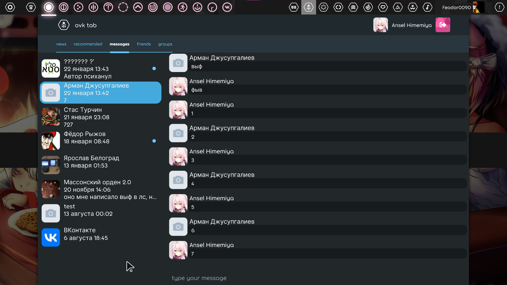

# ovktab
A custom ruleset for osu!lazer, that adds an overlay to use VK social network inside the game.



## Features list
Ovktab can provide you most of things that you need to browse VK communities and chat with your friends without opening browser. Don't expect a lot - it doesn't have video player, voice recorder, calls, uploads and so on. But instead, it has unique integration features with the game, such as direct files importing. You can see full list [here](https://github.com/Feodor0090/ovktab/projects/1). If you are sure that a feature is easy to implement, submit a request to issues.

# Installing
1. Download a latest [release](https://github.com/Feodor0090/ovktab/releases/) or build manually.
2. Click "Open osu! folder" in game settings, navigate to `rulesets` folder. On windows you can just go to `%appdata%/osu/rulesets` (if you didn't change folder location).
3. Copy ruleset DLL here.
4. Make sure that [VkNet](https://github.com/vknet/vk) library DLL also placed in rulesets folder (VkNet.dll) - ovktab use it. If not, download from our releases page or build yourself. You can find one inside `Tests` project build, take from NuGet folder or build manually.
5. Restart the game, enjoy!
6. If you encounter issues, report to this repo.
7. If the game randomly crashes or fails to startup, uninstall this ruleset! It works via multiple hacks, so can easily break the whole game.

# Building
Ruleset:
```
dotnet build osu.Game.Rulesets.OvkTab
```

Test browser:
```
dotnet build osu.Game.Rulesets.OvkTab.Tests
```
Note that some functionality (especially, integrations) requires you to run inside full game instance and use default server (osu.ppy.sh). So, some features won't work correctly inside test browser.
